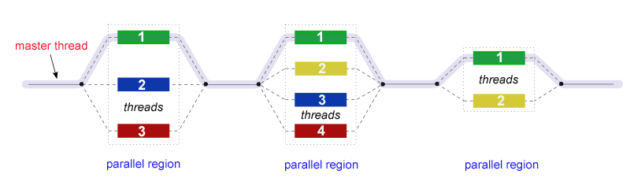

# Serial Genetic Algorithm VS Parallel Genetic Algorithm

>This Repository Contain a Comparative Study Between Serial Genetic Algorithm and Parallel Genetic Algorithm for solving The Traveling Salesman Problem .
---
## Genetic Algorithm
genetic algorithm (GA) is a metaheuristic inspired by the process of natural selection that belongs to the larger class of evolutionary algorithms (EA). Genetic algorithms are commonly used to generate high-quality solutions to optimization and search problems by relying on biologically inspired operators such as mutation, crossover and selection [[1]](en.wikipedia.org/wiki/Genetic_algorithm).
> The PseudoCode of Genetic Algorithm is like Below :

Genetic Algorithm Contains those steps :
* generate The Initial Population .
    - to generate the initial Population we've two choise :
    - initialze it Randomly , this is what we called **Random Initialisation**
    - or we can initialze it with the result that someone else get , this is what we called **Heuristic Initialisation** .  
* Calculate The Fitness for Each Element ...
    - in our case the Fitness Function is :
    
    
    - is This Work we Used Euclidean Distance The Formula is like below :
    
    
* Selection 
    - the selection process Consists of Selecting Some Individuals and apply on them CrossOver and Mutation to pass them to The Next Generation .
    - There is a lot of Selection Methods like :
        - Elitism Selection .
        - Touranment Selection .
        - Roulette Wheel Selction .
        - Rank Selection .
        - Random Selection .
* CrossOver
    - crossover, also called recombination, is a genetic operator used to combine the genetic information of two parents to generate new offspring or Children.
    - There is a lot of CrossOver Methods like :
        - One Point CrossOver .
        - Two Point CrossOver .
        - OX1 CrossOver .
* Mutation 
    - Mutation is a genetic operator used to maintain genetic diversity from one generation of a population of genetic algorithm chromosomes to the next.
    - There is a lot of Mutation Methods like :
        - Bit Flip Mutation .
        - Swap Mutation .
        - Scramble Mutation .
        - Inversion Mutation .         
---
## Traveling Salesman Problem
Genetic Algorithm can bet used to find high quality Solution in a short time for NP-Hard Problems such as Traveling SalesMan Problem , Knapsack problem , Clique problem ...

> TSP Mathematical Model is like below :

> with T[i] is a candidate Tour , and f is the Fitness Function .

>In this Work we used Genetic Algorithm to solve The traveling salesman problem .

>The travelling salesman problem (also called the traveling salesperson problem or TSP) asks the following question: "Given a list of cities and the distances between each pair of cities, what is the shortest possible route that visits each city exactly once and returns to the origin city?" [[2]](en.wikipedia.org/wiki/Travelling_salesman_problem).

## Implementation
>The main goal of this work is to improve the genetic algorithm by applying Parallelism Processing .

---
> To Apply Parallelism Processing, we used two Libraries , OpenMP and MPI .

> OpenMP Programming Model :

---
> MPI Programming Model :

in this work we used two approaches :
* The First Approach using one side Communication (Send and Recv) .
  
* The second Approach using Cooperative Communication (MPI_Alltoall)
  

## Result
---
> Serial Genetic Algorithm result :

---
> Parallel Genetic Algorithm result :

---
>Parallel GA vs Serial GA

> To Generate The charts we Used This Script [script](Resources/Generator.py)

> in This Work we Used Berlin DataSet that conatin 52 City [Berlin](Resources/_Berlin52.txt)